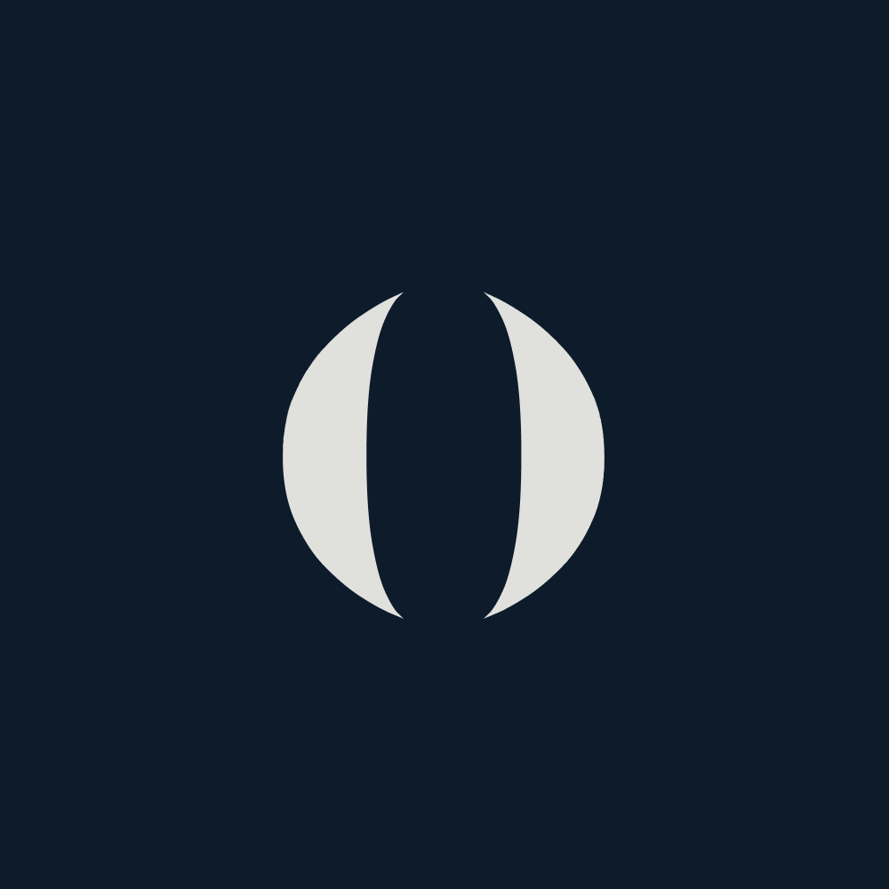

<a name="readme-top"></a>

<br />
<div align="center">
  <a href="https://github.com/github_username/categorease">
    
  </a>

<h3 align="center">Categorease</h3>

  <p align="center">
    A chat application that categorizes chat rooms, built with Golang and Flutter.
  </p>
</div>

## About The Project

![Categorease][Product-screenshot]

CategorEase is a chat application built with Golang for the backend and Flutter for the frontend. This project was inspired by my need to keep track of numerous college class groups, as WhatsApp lacked a feature to categorize groups or chat rooms at that time. Additionally, I wanted to learn more about WebSocket communication and gain proficiency in Golang. Thus, CategorEase was born.

### Features

- Communication between users
- Categorize a chat room
- Customize category
- Authentication
- Edit room (add more user, remove user from room)
- Filter room by category
- Backend Integration

### Built With

#### Frontend
[![Flutter][Flutter.dev]](https://flutter.dev/)
[![Dart][Dart.dev]](https://dart.dev/)

#### Backend
[![Golang][Golang.org]](https://golang.org/)
[![GORM][Gorm.io]](https://gorm.io/)
[![PostgreSql][Postgresql.org]]((https://www.postgresql.org/))

## Getting Started

### Prerequisites

- Run the backend server in [here](https://github.com/letha11/go-chat)
- Flutter or [fvm](https://github.com/leoafarias/fvm)

### Installation

1. Clone the repo
   ```sh
   git clone https://github.com/github_username/categorease.git
   cd categorease
   ```

2. Install Flutter dependencies using FVM **(RECOMMENDED)**
   ```sh
   fvm install
   fvm flutter pub get
   fvm flutter run
   ```

3. If you already have a flutter installed
    ```
    flutter pub get
    flutter run
    ```

## Contributing

Contributions are welcome! Please open an issue or submit a pull request.

## License

This project is licensed under the MIT License.


<!-- MARKDOWN LINKS & IMAGES -->
[Flutter.dev]: https://img.shields.io/badge/Flutter-02569B?style=for-the-badge&logo=flutter&logoColor=white
[Dart.dev]: https://img.shields.io/badge/Dart-0175C2?style=for-the-badge&logo=dart&logoColor=white
[Golang.org]: https://img.shields.io/badge/Go-00ADD8?style=for-the-badge&logo=go&logoColor=white
[Gorm.io]: https://img.shields.io/badge/GORM-00ADD8?style=for-the-badge&logo=go&logoColor=white
[Postgresql.org]: https://img.shields.io/badge/PostgreSQL-336791?style=for-the-badge&logo=postgresql&logoColor=white
[Product-screenshot]: ./assets/readme-assets/mockup.png